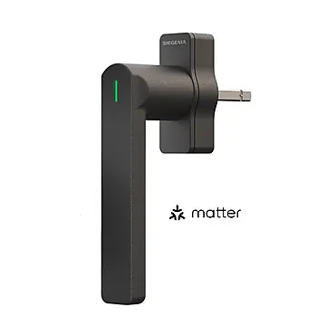

# An Template which tells you in which position your Windows ist


Create in Helpers > template > Sensor


then copy the code in: [`SIEGENIA_Smart_Window_Handle.yaml`](./SIEGENIA_Smart_Window_Handle.yaml)

and change in the
('') with your sensors.
```yaml


```
